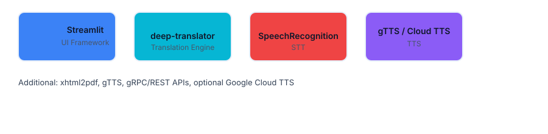
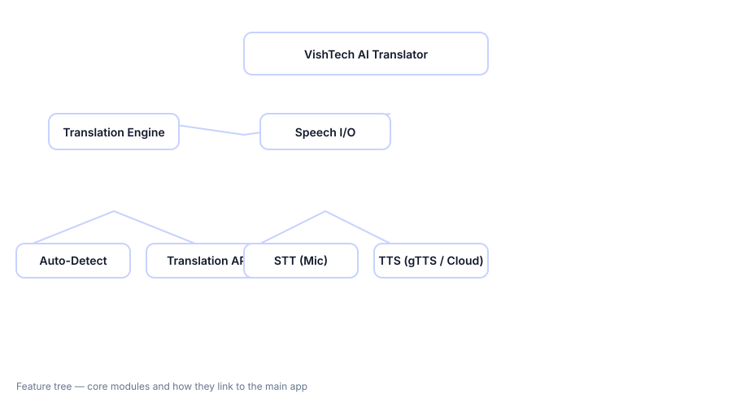

# CodeAlpha_Language-Translation-Tool


## Description

VishTech AI Translator is a lightweight, mobile-friendly web app for fast multilingual translation with text and voice I/O, exportable reports, and a modern responsive UI.

## Live Demo

https://vistech-language-translator-sui8p3qxezsb8ywmycwhfj.streamlit.app/

## Tech Stack

1. Streamlit (UI)
2. deep-translator (translation)
3. SpeechRecognition (STT)
4. gTTS / Google Cloud TTS (TTS)
5. xhtml2pdf (PDF export)



## Key Features

1. Instant translation with auto-detect
2. Voice input (microphone) and selectable TTS voices
3. Download translations as TXT and PDF
4. Light / Dark theme with responsive layout
5. Session history and exportable reports

## Feature Flow



## Run Locally

```bash
pip install -r requirements.txt
c:/Users/Lenovo/Language-Translator/venv/Scripts/python.exe -m streamlit run app.py
```

## Credits

Made by Aman Singh — built with care for mobile UX and accessibility.
